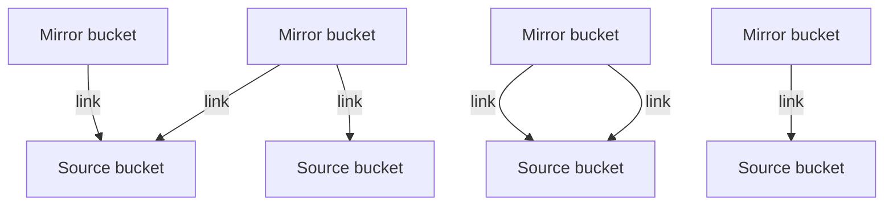

# Getting started

## Diagram

```mermaid
graph TD

Mirror1["Mirror bucket"] -->|link| Source1["Source bucket"]
Mirror2["Mirror bucket"] -->|link| Source1
Mirror2 -->|link| Source2["Source bucket"]

Mirror3["Mirror bucket"] -->|link| Source3["Source bucket"]
Mirror3 -->|link| Source3

Mirror4["Mirror bucket"] -->|link| Source4["Source bucket"]
```