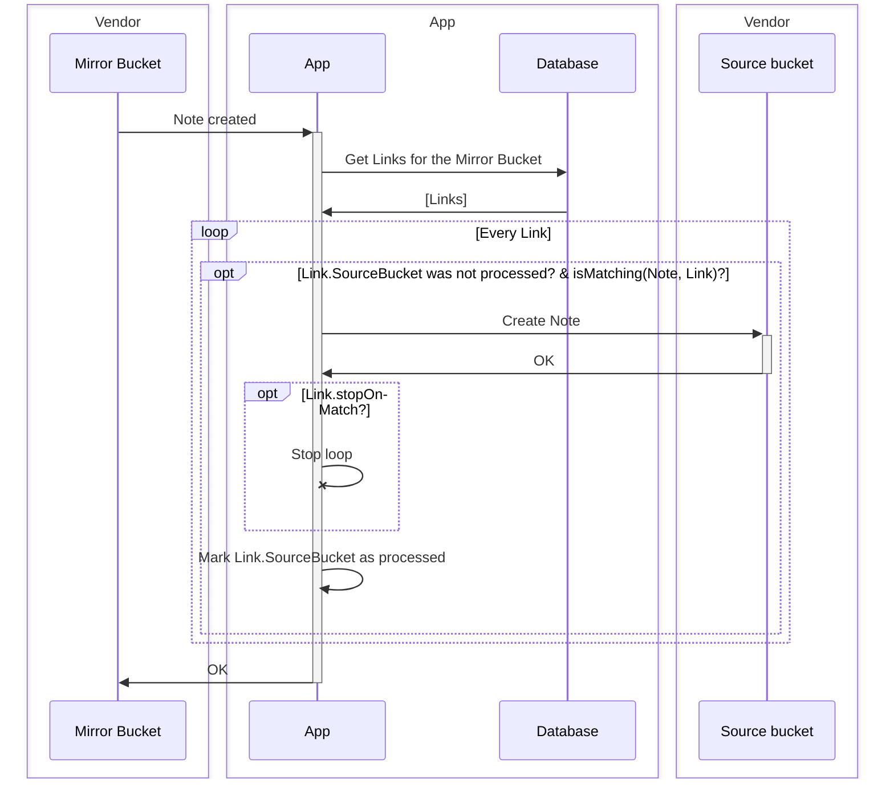
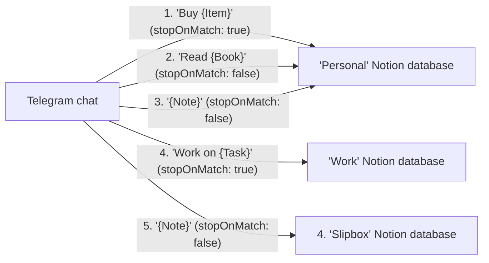

# Handle Note created in a Mirror Bucket

## Diagram

## Examples

- `Buy something`
  1. ✅ `Buy {Item}` -> **Personal** (_stopOnMatch: true_)
  2. ~~`Read {Book}` -> **Personal** (_stopOnMatch: false_)~~
  3. ~~`{Note}` -> **Personal** (_stopOnMatch: false_)~~
  4. ~~`Work on {Task}` -> **Work** (_stopOnMatch: true_)~~
  5. ~~`{Note}` -> **Slipbox** (_stopOnMatch: false_)~~
> Matches Links 1, 3 and 5, but since Link 1 has `stopOnMatch` enabled, only Link 1 is processed.

- `Read a book`
  1. ❌ `Buy {Item}` -> **Personal** (_stopOnMatch: true_)
  2. ✅ `Read {Book}` -> **Personal** (_stopOnMatch: false_)
  3. ⏩ `{Note}` -> **Personal** (_stopOnMatch: false_)
  4. ❌ `Work on {Task}` -> **Work** (_stopOnMatch: true_)
  5. ✅ `{Note}` -> **Slipbox** (_stopOnMatch: false_)
> Matches Links 2, 3 and 5, but since Links 2 and 3 belong to the same bucket, only Links 2 and 5 are processed. Link 3 is skipped.

> **RULE: Only one match is allowed per one Source Bucket**

- `Work on a task`
  1. ❌ `Buy {Item}` -> **Personal** (_stopOnMatch: true_)
  2. ❌ `Read {Book}` -> **Personal** (_stopOnMatch: false_)
  3. ✅ `{Note}` -> **Personal** (_stopOnMatch: false_)
  4. ✅ `Work on {Task}` -> **Work** (_stopOnMatch: true_)
  5. ~~`{Note}` -> **Slipbox** (_stopOnMatch: false_)~~
> Matches Links 3, 4 and 5, but since Link 4 has `stopOnMatch` enabled, only Link 3 and 4 are processed.

- `Watch a movie`
  1. ❌ `Buy {Item}` -> **Personal** (_stopOnMatch: true_)
  2. ❌ `Read {Book}` -> **Personal** (_stopOnMatch: false_)
  3. ✅ `{Note}` -> **Personal** (_stopOnMatch: false_)
  4. ❌ `Work on {Task}` -> **Work** (_stopOnMatch: true_)
  5. ✅ `{Note}` -> **Slipbox** (_stopOnMatch: false_)
> Matches Links 3 and 5.
