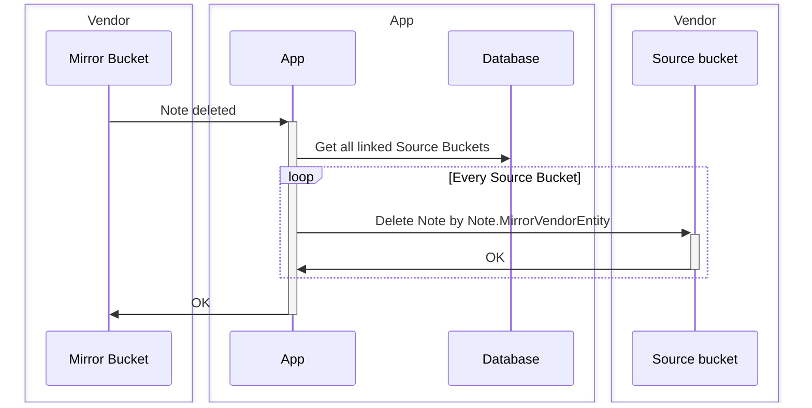

# Handle Note deleted in a Mirror Bucket

## Diagram

```mermaid
sequenceDiagram

box Vendor
participant mirror as Mirror Bucket
end

box App
participant app as App
participant db as Database
end

box Vendor
participant source as Source bucket
end

mirror ->>+ app: Note deleted
app ->> db: Get all linked Source Buckets

loop Every Source Bucket
  app ->>+ source: Delete Note by Note.MirrorVendorEntity
  source ->>- app: OK
end

app ->>- mirror: OK
```
