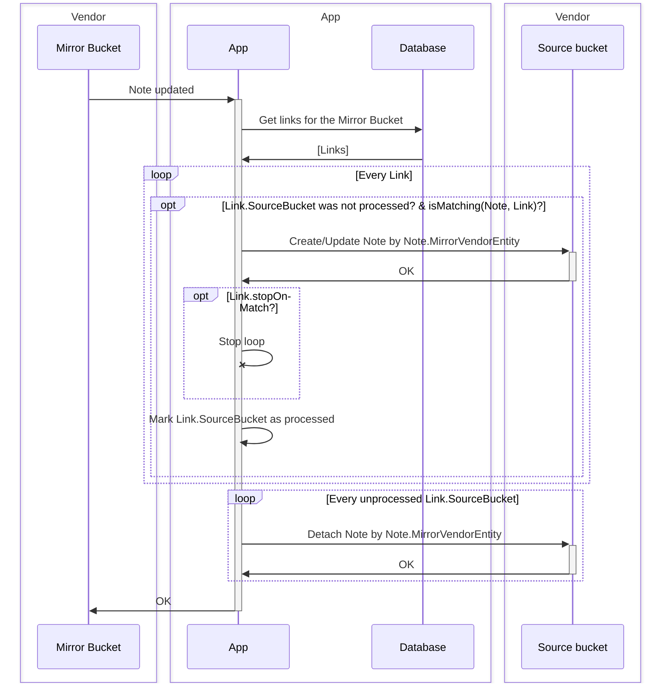

# Handle Note updated in a Mirror Bucket

## Diagram

```mermaid
sequenceDiagram

box Vendor
participant mirror as Mirror Bucket
end

box App
participant app as App
participant db as Database
end

box Vendor
participant source as Source bucket
end

mirror ->>+ app: Note updated
app ->> db: Get links for the Mirror Bucket
db ->> app: [Links]

loop Every Link
  opt Link.SourceBucket was not processed? & isMatching(Note, Link)?
    app ->>+ source: Create/Update Note by Note.MirrorVendorEntity
    source ->>- app: OK

    opt Link.stopOnMatch?
      app -x app: Stop loop
    end

    app ->> app: Mark Link.SourceBucket as processed
  end
end

loop Every unprocessed Link.SourceBucket
  app ->>+ source: Detach Note by Note.MirrorVendorEntity
  source ->>- app: OK
end

app ->>- mirror: OK
```
