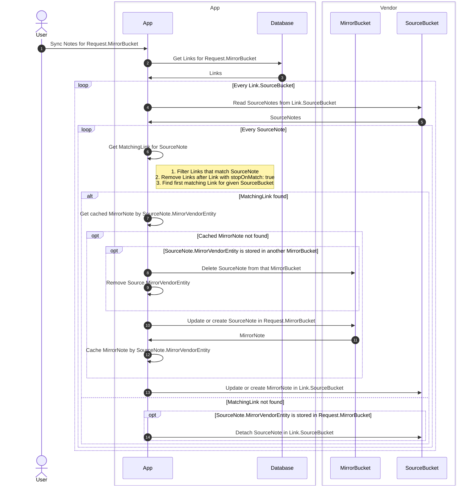

# Sync Notes from linked Source Buckets to a Mirror Bucket

## Diagram

```mermaid
sequenceDiagram
autonumber

actor user as User

box App
participant app as App
participant db as Database
end

box Vendor
participant mirror as MirrorBucket
participant source as SourceBucket
end

user ->> app: Sync Notes for Request.MirrorBucket
app ->> db: Get Links for Request.MirrorBucket
db ->> app: Links

loop Every Link.SourceBucket
  app ->> source: Read SourceNotes from Link.SourceBucket
  source ->> app: SourceNotes

  loop Every SourceNote
    app ->> app: Get MatchingLink for SourceNote
    note right of app: 1. Filter Links that match SourceNote<br/>2. Remove Links after Link with stopOnMatch: true<br/>3. Find first matching Link for given SourceBucket

    alt MatchingLink found
      app ->> app: Get cached MirrorNote by SourceNote.MirrorVendorEntity

      opt Cached MirrorNote not found
        opt SourceNote.MirrorVendorEntity is stored in another MirrorBucket
          app ->> mirror: Delete SourceNote from that MirrorBucket
          app ->> app: Remove Source.MirrorVendorEntity
        end

        app ->> mirror: Update or create SourceNote in Request.MirrorBucket
        mirror ->> app: MirrorNote

        app ->> app: Cache MirrorNote by SourceNote.MirrorVendorEntity
      end

      app ->> source: Update or create MirrorNote in Link.SourceBucket
    else MatchingLink not found
      opt SourceNote.MirrorVendorEntity is stored in Request.MirrorBucket
        app ->> source: Detach SourceNote in Link.SourceBucket
      end
    end
  end
end
```
